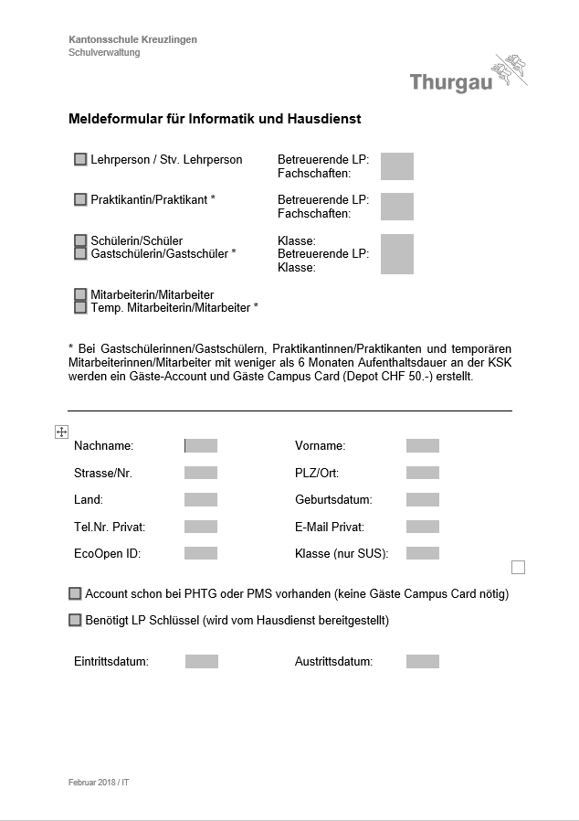

# Architekturkonzept

## Aufgabenstellung

Das Ziel meines Projektes ist das ermöglichen von digitalem Eintragen von Gastschüler und Gastlehrer.
Im Grunde sollte es die gleichen Funktionen wie folgendes Formular erfüllen:

Die Optimale Version des Programmes sollte folgende funktionen enthalten. Die Endversion kann jedoch mehr oder weniger von dieser Version abweichen:

1. Aktive Gäste werden in einer Tabelle dargestellt mit wichtigen Informationen:
    - Vorname
    - Nachname
    - Gästeart
    - Gästekarte: JA / NEIN
    - Austrittsdatum

2. Detaillierte Informationen zur Personen können geöffnet werden:
    - Vorname
    - Nachname
    - E-Mail
    - Telefon
    - Adresse mit Land, PLZ und Ort
    - Geburtsdatum
    - Gästeart
    - Gästekart: JA / NEIN
    - PH oder KSK Account
    - Klasse
    - Bei Praktikanten: Betreuende Lehrperson
    - Bei Lehrperson: Fachschaft
    - Schlüssel: JA / NEIN

2. Die Tabelle kann nach Gästearten sotiert werden:
    - Gastschüler
    - Praktikanten
    - Temporäre Mitarbeiter
    - Stellvertretende Lehrer

3. Es können Gäste hinzugefügt und Entfernt werden

4. Beim Hinzufügen kann man zwischen den Gästearten wählen welche dann anschliessend nur die Benötigten Eingabefelder ausgeben

4. Hinzufügen kann abgebrochen werden

5. Feedback sobald eine Person hinzugefügt wurde

6. Bereits eingetragene Personen können editiert werden

7. Alle Gäste werden in einem Archiv gespeichert

### Skitze der Applikation

Personen:

Detail Informationen:

Gast hinzufügen:

Archiv:

## MVC Anwendung

Das das Projekt mit MVC durchgeführt wird, braucht es dementsprechend auch die MVC Model, Views und Controller.

### Models

Als Models stelle ich mir nur das Model **Gast**  vor.

In diesem Model, werden die Daten der Gäste gespeichert.
Da nicht jeder Gast die gleichen Daten hat, wird bei irrelevanten Daten einfach *NULL* verwendet.

Sobald ein Datensatz *NULL*, dann wird er einfach nicht angezeigt.

### Views

Folgende Views werden benötigt:

- View GuestTable (Tabelle in der alle Gäste angezeigt werden)
- View Details (Anzeigen von alles Informationen eines Gastes)
- View Add (Zeigt das Fenster zu einfügen von Informationen an)
- View Archive (Zeigt die Archiv Tabelle an)

Die Views werden mithilfe von Twig template engine gemacht.

### Controller

Die Controller ist die Logik des Programms.
Deshalb verwende ich Controller an allen Orten an denen eine Interaktion möglich sein muss:

- AddGuest (Erstellt einen Gast mit den eigegebenen Daten)
- DeleteGuest (Entfernt den gewählten Gast)

In den Controlle befinden sich dann wichtige Funktionen wie:

- AddGuest.guestType() (Wählt den Gast-Typ und entfernt unwichtige Felder)
