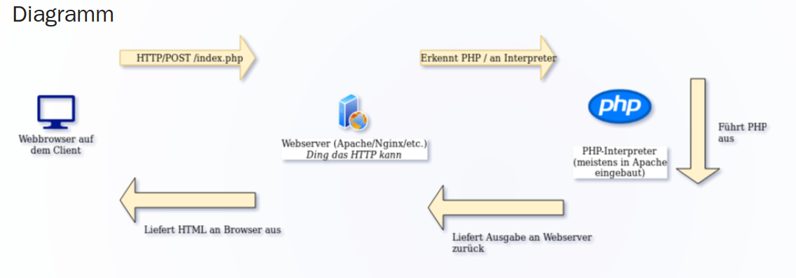

# CSR und SSR

[Themen](MD/THEMEN.md)

[Quelle](https://medium.com/@prashantramnyc/server-side-rendering-ssr-vs-client-side-rendering-csr-vs-pre-rendering-using-static-site-89f2d05182ef)

## Allgemein

CSR bedeutet **Client side rendering**
SSR bedeutet **Server side rendering**

## SSR

Beim SSR werden die HTML komponente für die Webseite Server-seitig generiert. Wenn ein Client Browser eine Anfrage macht, dann erhält der Browser ein komplettes HTML mit allen HTML Komponenten vorgeneriert.

**Vorteile:**

* Webseite ist besser findbar

* Schnellere Ladezeiten

* Sobald die Seite sichtbar ist, dann ist sie völlig interaktiv

* Browser JS muss nicht aktiviert sein

**Nachteile:**

* Responsetime ist schlecht bei schlechter Internetverbindung

* Server wir stärker ausgelastet

### Diagram

## CSR
