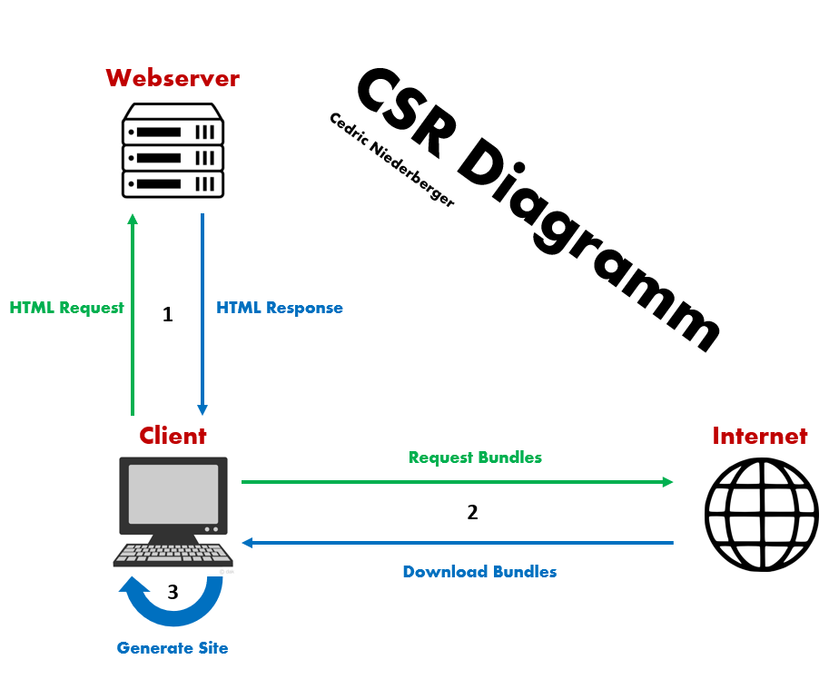

# CSR und SSR

[Themen](MD/THEMEN.md)

[Quelle](https://medium.com/@prashantramnyc/server-side-rendering-ssr-vs-client-side-rendering-csr-vs-pre-rendering-using-static-site-89f2d05182ef)

## Allgemein

CSR bedeutet **Client side rendering**
SSR bedeutet **Server side rendering**

## SSR

Beim SSR werden die HTML komponente für die Webseite Server-seitig generiert. Wenn ein Client Browser eine Anfrage macht, dann erhält der Browser ein komplettes HTML mit allen HTML Komponenten vorgeneriert.

**Vorteile:**

* Webseite ist besser findbar
* Schnellere Ladezeiten
* Sobald die Seite sichtbar ist, dann ist sie völlig interaktiv
* Browser JS muss nicht aktiviert sein

**Nachteile:**

* Responsetime ist schlecht bei schlechter Internetverbindung
* Server wir stärker ausgelastet

### Diagram

## CSR

Beim CSR werden HTML Komponente beim Client generiert indem JS ausgeführt wird. Wenn der Browser die Webpage anfordert, dann wir eine kleines HTML file übertragen welches als Container verwendet wird und verschiedene JS / PHP bundle usw beinhaltet.
Dabei muss der Browser die Bundle welche im HTML verlinkt sind eigenständig Herunterladen welche dann die HTML produziert.

**Vorteil**

* Extrem schnell nachdem die Seite das erste mal geladen hat

**Nachteile:**

* Langsame Requestladezeit
* Schlechter Einfluss beim page ranking
* Nicht funktionell wenn JS browserseitig deaktiviert ist

### Diagram

